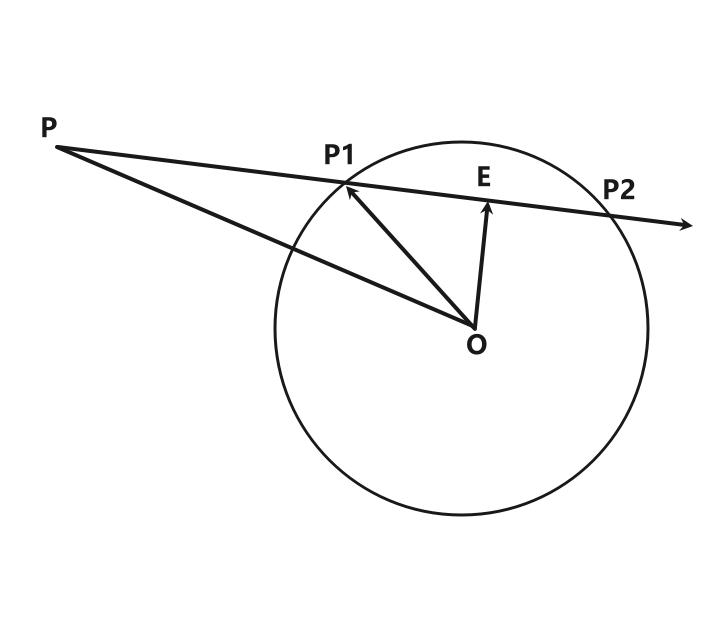
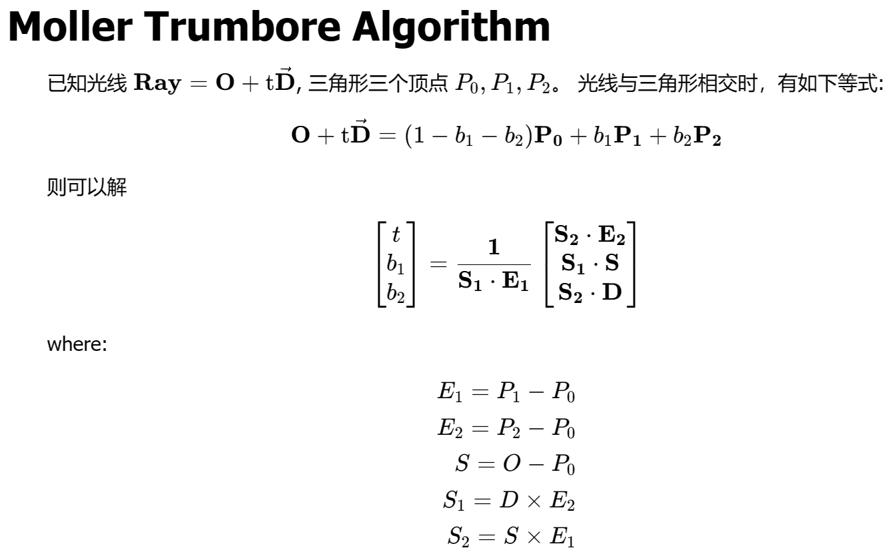

# 相交相关的计算

## 判断点是否在三角形内部

### 通过面积判断

- 如果点和三角形的三个顶点构成的三个三角形的面积与大三角形的面积相等, 则点在三角形内部
- 这种方法可以不用事先判断点是否与三角形共面

```ts
export const pointInTriangleV3_1 = (triangle: Vector3[], P: Vector3) => {
  const [A, B, C] = triangle

  const ab = B.clone().sub(A)
  const bc = C.clone().sub(B)
  const area2 = ab.clone().cross(bc).length() // 向量叉乘的模为构成三角形面积的两倍
  let area2_1 = 0

  for (let i = 0; i < 3; i++) {
    const P1 = triangle[i]
    const P2 = triangle[(i + 1) % 3]
    area2_1 += P1.clone().sub(P).cross(P2.clone().sub(P)).length()
  }

  return Math.abs(area2_1 - area2) <= 1e-5
}
```

### 通过叉积判断 (二维)

- 判断叉积值的正负

```ts
export const cross = (v1: Num2, v2: Num2) => {
  return v1[0] * v2[1] - v1[1] * v2[0]
}
export const pointInTriangleV2 = (triangle: Num2[], P: Num2) => {
  for (let i = 0; i < 3; i++) {
    const P1 = triangle[i]
    const P2 = triangle[(i + 1) % 3]
    const v1: Num2 = [P1[0] - P[0], P1[1] - P[1]]
    const v2: Num2 = [P2[0] - P[0], P2[1] - P[1]]
    // 顶点逆时针的情况下用 < 0, 顺时针用 > 0
    if (cross(v1, v2) < 0) return false
  }
  return true
}
```

### 通过叉积判断 (三维)

- 判断叉积是否与三角形法向量同方向 (通过叉积与法向量的点积判断)
- 这种方法需要事先判断点是否与三角形在同一平面内

```ts
export const pointInTriangleV3_2 = (triangle: Vector3[], P: Vector3) => {
  const [A, B, C] = triangle

  const ab = B.clone().sub(A)
  const bc = C.clone().sub(B)
  const n = ab.clone().cross(bc)

  for (let i = 0; i < 3; i++) {
    const P1 = triangle[i]
    const P2 = triangle[(i + 1) % 3]
    // 判断叉积是否大于等于 0
    // 三维向量叉积为法向量,需要判断 _n 和 n 是否同向, 同向则大于等于 0
    const _n = P1.clone().sub(P).cross(P2.clone().sub(P))
    const dot = _n.clone().dot(n)
    if (dot < 0) return false
  }

  return true
}
```

## 射线与平面的交点

- P = P1 + t\*v 射线表示为起点 + t倍的方向向量
- n·(P - P2) = 0 平面内的向量与平面法向量垂直(点乘为 0)

```ts
/**
 *
 * @param P1 射线起点
 * @param v 射线方向
 * @param P2 平面内一点
 * @param n 平面法向量
 */
export const rayIntersectPlane = (P1: Vector3, v: Vector3, P2: Vector3, n: Vector3) => {
  // 1: P = P1 + t*v
  // 2: n·(P - P2) = 0
  // => n·(P1 + t*v - P2) = 0
  // => t = (n·P2 - n·P1)/(n·v)

  const dotV = n.clone().dot(v)
  // dotV === 0 射线与平面平行
  // dotV > 0 射线与平面背面相交
  if (dotV >= 0) return null

  const t = (n.clone().dot(P2) - n.clone().dot(P1)) / dotV
  // 平面与射线反方向相交
  if (t < 0) return null
  const P = P1.clone().add(v.clone().multiplyScalar(t))
  return P
}
```

## 射线与球的交点



```ts
/**
 * 射线和球是否相交
 * @param P 射线起点
 * @param v 射线方向
 * @param O 圆心
 * @param r 半径
 */
export const isRayIntersectSphere = (P: Vector3, v: Vector3, O: Vector3, r: number) => {
  const po = O.clone().sub(P)
  const pe_len = po.clone().dot(v)
  const oe_len = Math.sqrt(po.length() ** 2 - pe_len ** 2)
  return oe_len <= r
}
```

```ts
/**
 * 射线和球的交点
 * @param P 射线起点
 * @param v 射线方向
 * @param O 圆心
 * @param r 半径
 */
export const rayIntersectSphere = (P: Vector3, v: Vector3, O: Vector3, r: number) => {
  const po = O.clone().sub(P)
  const pe_len = po.clone().dot(v)

  const oe_len = Math.sqrt(po.length() ** 2 - pe_len ** 2)

  // 没有交点
  if (oe_len > r) return []

  // 当作只有一个交点(相切)
  if (Math.abs(r - oe_len) < 1e-5) {
    const t = pe_len
    return [{ t: t, point: P.clone().add(v.clone().multiplyScalar(t)) }]
  }

  // 有两个交点
  const p1e_len = Math.sqrt(r ** 2 - oe_len ** 2)

  const t1 = pe_len - p1e_len
  const t2 = pe_len + p1e_len

  return [
    { t: t1, point: P.clone().add(v.clone().multiplyScalar(t1)) },
    { t: t2, point: P.clone().add(v.clone().multiplyScalar(t2)) },
  ]
}
```

## 射线和三角面的交点

[直线与三角形相交Moller Trumbore算法推导](https://www.blurredcode.com/2020/04/%E7%9B%B4%E7%BA%BF%E4%B8%8E%E4%B8%89%E8%A7%92%E5%BD%A2%E7%9B%B8%E4%BA%A4moller-trumbore%E7%AE%97%E6%B3%95%E6%8E%A8%E5%AF%BC/)



```ts
/**
 *
 * @param triangle 由三个Vector3组成的三角形
 * @param P 射线起点
 * @param v 射线方向
 */
export const rayIntersectTriangle = (triangle: Vector3[], P: Vector3, v: Vector3) => {
  const [A, B, C] = triangle
  const e1 = B.clone().sub(A)
  const e2 = C.clone().sub(A)
  const s = P.clone().sub(A)
  const s1 = v.clone().cross(e2)
  const s2 = s.clone().cross(e1)

  const dotV = s1.clone().dot(e1)
  // dotV === 0 射线和三角面平行
  // dotV < 0 射线和三角面背面相交
  if (dotV <= 0) return null

  const [t, b, c] = [s2.clone().dot(e2), s1.clone().dot(s), s2.clone().dot(v)].map(item => item * (1 / dotV))
  // 三角形与射线反方向相交
  if (t < 0) return null

  const a = 1 - b - c

  // 点不在三角形内部
  if (a < 0 || a > 1 || b < 0 || b > 1 || c < 0 || c > 1) return null

  return { t, a, b, c, point: P.clone().add(v.clone().multiplyScalar(t)) }
}
```

## 应用

用于射线拾取: 先检测射线是否与几何体的包围球相交, 如果相交则遍历几何体的三角面判断是否与几何体相交或者求出相交点
